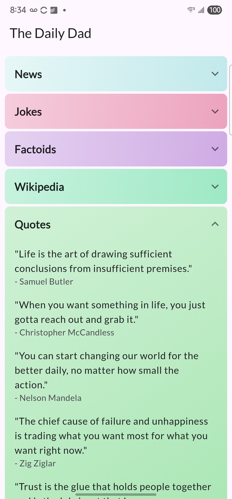

# The Daily Dad

The Daily Dad is a simple, elegant Flutter application designed to provide a fresh dose of daily content in a clean, expandable format. It's built to be a small, delightful part of your daily routine. I built this for myself so I could be "an interesting guy" at the dinner table. Your mileage may vary (as did mine!)

## Features

- **Daily Content:** Get new content every day across several interesting categories.
- **News:** Stay informed with the top headlines.
- **Jokes:** Enjoy a daily selection of classic dad jokes.
- **Factoids:** Learn something new with interesting trivia and facts.
- **Wikipedia:** Discover the featured article of the day and historical events from "On This Day".
- **Quotes:** Get inspired with a selection of insightful quotes.
- **Trivia:** Test your knowledge with interactive true/false questions.
- **Beautiful UI:** Each section is presented in a beautifully styled, expandable panel with random pastel gradients.
- **Pull-to-Refresh:** Force a refresh of the day's content whenever you like.

## Screenshot

## AI
As should be evident, I used Cursor with Gemini Pro 2.5 to generate much of this app. The process was quite enjoyable, and I only had to intervene when the AI crapped its pants, threw itself into a loop, or got very apologetic and started making extremely bad decisions to fix its earlier terrible decisions. Hallucinations are a feature, not a bug. That said, these tools 25x'd me to get this done in under 2 days (a big deal for me).

## Editor's note

This is my first Flutter application. AI seems like it was invented for folks like me to pick up alien technology like Flutter and become productive rather quickly. Do I understand Flutter deeply? Of course not. But do I know enough to be dangerous? Of course not.
